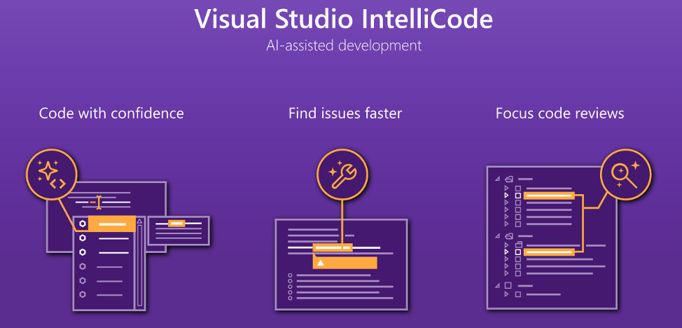
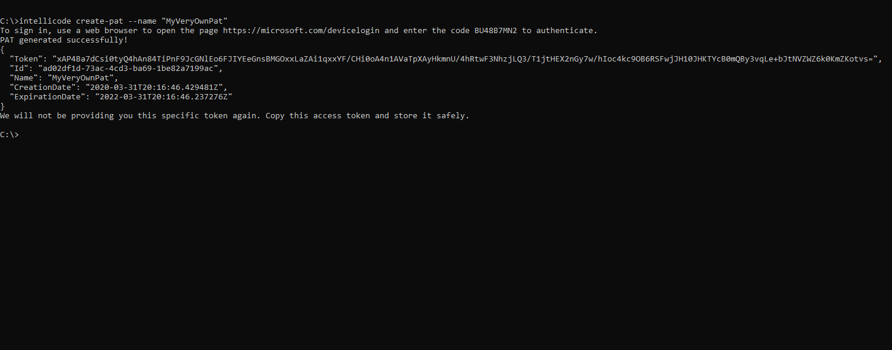
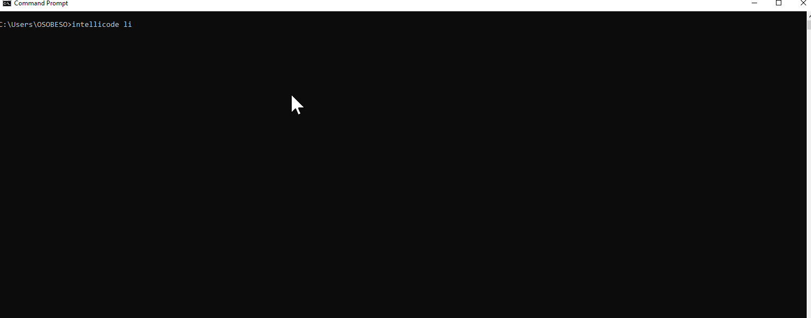

 

# Automate code completions tailored to your codebase with IntelliCode Team completions

Using this GitHub Action, [Visual Studio IntelliCode](https://marketplace.visualstudio.com/items?itemName=VisualStudioExptTeam.VSIntelliCode) automate training a Machine Learning completions model as part of your CI workflow to provide in-line, contextually-rich completion suggestions based on your own types in C# and C++.

Visual Studio IntelliCode saves you time by putting what you’re most likely to use at the top of your completion list. IntelliCode recommendations are based on thousands of open source projects on GitHub each with over 100 stars. When combined with the context of your code, the completion list is tailored to promote common practices. To get IntelliCode's starred completion suggestions for your own types, or other types not commonly found in open source, use [IntelliCode Team completions](https://aka.ms/vsic-teamcompletions-quickstart).

With this GitHub Action, you can keep your Team completion suggestions up-to-date with your repository’s latest commit by automating the Team completions model training. 

## Requirements

* Be the GitHub repo owner/administrator. Only those with repo administrative rights will have access to manage the required secret to run the IntelliCode GitHub Action.
* An IntelliCode personal access token (PAT) that authorizes IntelliCode services to invoke the GitHub.
* The build agent (MSBUILD, CMAKE) has the minimum required Visual Studio version installed:
For C# repositories: Visual Studio 2017 or higher
For C++ repositories: Visual Studio 2019 Update 4 or higher.

## Usage

The workflow is usually declared in `.github/workflows/intellicode.yml`.
* Here's what a C# workflow looks like:

```yaml
name: Main IntelliCode Workflow

on:
  push:
    branches: 
      - master # IntelliCode recommends training on master branch to increase your model availability.

jobs:
  build:
    runs-on: windows-latest

    steps:
    - uses: actions/checkout@v1 # Project needs to be checked out for us be able to analyze the code.
    - name: Setup .NET Core
      uses: actions/setup-dotnet@v1
      with:
        dotnet-version: <Your_Build_Version>
    - name: Build with dotnet
      run: dotnet build --configuration Release # Project needs to build before training a model.
 - name: Train Intellicode Model
      uses: microsoft/vs-intellicode@v1
      with:
        pat: ${{ secrets.VSIC_TOKEN }} # You need to create this personal access token.
```
**NOTE:** Training a C# model usually takes around the same time it takes to build the project. It depends entirely on the length of the codebase.


## Inputs

| Name          | Type              | Description  |
| ------------- |:-----------------:|:------------:|
| pat           | string (required) | The personal access token linked to your account. Use secrets to set this value. |
| platform      | string (optional) | Only for C++ repositories. Sets the platform for the C++ build (ARM, Any CPU, etc). |
| config        | string (optional) | Only for C++ repositories. Sets the configuration for the C++ build (Debug, Release). |


## Generate a personal access token (PAT)

**Visual Studio 2019** is required in order to have access to a personal access token. 
If you don't have Visual Studio installed you can [download Community edition](https://visualstudio.microsoft.com/downloads/) for free.

Using the VS developer command prompt (In Visual Studio go to Tools > CommandLine > Developer Command Prompt) run the following command:
> intellicode create-pat --name "<your_pat_name>"

A message will be printed for device authentication, providing you with a device id. 

- Visit [https://microsoft.com/devicelogin](https://microsoft.com/devicelogin) to complete authentication using the id you obtained from running the command.
- Once you authenticate using your Microsoft Account, the token will be printed in the Developer command prompt. 
- Store that token safely since it’s the only time our tool will be providing you with that specific token.

You can always create a new token if you need by following the same steps. 

**NOTE:** Although for security reasons, we don’t recommend creating more tokens than needed. You can reuse the same token across repositories.

## Secrets

- `VSIC_TOKEN` – **Required** this is the token used to authenticate access to IntelliCode. You can generate a token in Visual Studio in the Visual Studio Developer Command Prompt. You can set the `VSIC_TOKEN` environment variable in the "Secrets" settings page of your repository (in Settings > Secrets > Add a new secret).

**NOTE:** If you are not able to see the Settings tab, it’s likely you don’t have the required permissions to manage repository secrets.

- Specify your secret name _(e.g. VSIC_TOKEN)._
- Add the PAT value you obtained from the VS developer command prompt into the Value field and save your new secret.

You can now use this secret in your pipeline to run IntelliCode team model trainings.

 

## Managing your personal access token

Personal access tokens can be managed using the same Visual Studio developer command prompt. You can create as many tokens as you need, and you can also reuse the same token across different repositories.
These tokens will be linked to the user account that created them. For security reasons, always make sure you expire or delete tokens you no longer need.

In order to see a list of your personal access tokens, you can run the following command using the VS developer command prompt
> intellicode list-pat

If you wish to invalidate or delete a previously created personal access token, use the list command to fetch the Id of the token you
want to delete, and then run the following command:
> intellicode delete-pat --pat-id "<your_pat_id>"

 

## Troubleshooting and Feedback

**Having trouble running the Github Action?**
If you are having issues with running the IntelliCode GitHub Action or would like to provide feedback, let the IntelliCode team know on [the IntelliCode GitHub issues community forum ](https://aka.ms/vsicissues). If you reproduce the problem before submitting your issue, please attach images and/or gifs to the issue to facilitate our investigations.
Be sure to tag your issue with the tag `feedback` or `issue`

**Not seeing any IntelliCode completions in Visual Studio?**
If you are not able to see any IntelliCode completions, you may have extensions installed that are overriding the IntelliSense UI. This can prevent the IntelliCode "starred" suggestions from appearing at the top of the list. You can verify if extensions are causing this behavior by turning them off and then trying IntelliSense again. Or, if the extension supports it, turn off its auto-completion features.

To report an IntelliCode` for Visual Studio bug, use the [Help > Send Feedback > Report a Problem](https://docs.microsoft.com/en-us/visualstudio/ide/how-to-report-a-problem-with-visual-studio) menu. If you reproduce the problem before submitting the report, logs are automatically included in the report.

**Do you have suggestions on how we can make our product better?**

For feature requests or suggestions click the  **Send feedback about** > **This product** button at the bottom of this page to log a new issue. Mention that it's a feature request.

## See also

- [IntelliCode overview](https://aka.ms/intellicode)
- [Custom models based on your code](https://aka.ms/vsic-teamcompletions-quickstart)
- This project has adopted the [Microsoft Open Source Code of Conduct](https://opensource.microsoft.com/codeofconduct/).
- For more information see the [Code of Conduct FAQ](https://opensource.microsoft.com/codeofconduct/faq/) or
contact [opencode@microsoft.com](mailto:opencode@microsoft.com) with any additional questions or comments.
- [Privacy Policy](https://privacy.microsoft.com/en-us/privacystatement)


## Supported build configurations
 
* Your code is built with MSBUILD
* Your code is built with CMAKE for native C++ code

## License

The files and documentation in this project are released under the MIT License.